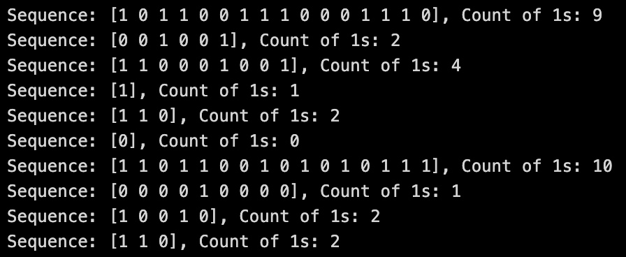
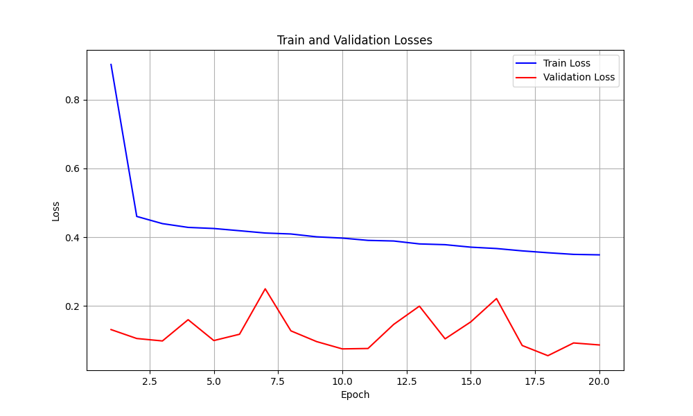
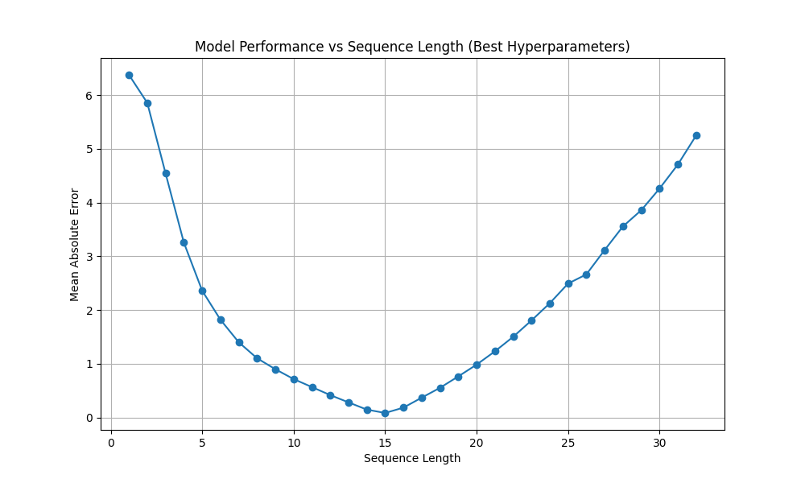

# OCR

## 4. RNNs

### 4.1 Counting Bits

#### 4.1.1 Task 1 : Dataset

Construected a dataset of binary sequences and stored them as tuples of (sequence, count) pairs. Examples are :- 

After this, split the dataset into training, validation and test sets with the following splits - (0.8, 0.1, 0.1)

### 4.1.2 Task 2 : Architecture

Tried out various types of hyperparameters and found the best one to be with the following combination: - 

- Used layer normalization
- hidden_size = 64
- num_layers = 2
- dropout = 0.2
- lr = 0.0001
- criterion = nn.L1Loss()

### 4.1.3 Task 3 : Training 

Trained the model to get the final loss on training and validation sets as follows:

- Training Loss: 0.3485
- Validation Loss: 0.0866

Plotted the training and validation losses across all epochs on a graph.

Random Baseline MAE: 2.55304

### 4.1.4 Task 4 : Generalization

Explanation 

- The lowest MAE at 15 bits reflects that this is the length with the most training experience for the model.

- Shorter sequences have fewer bits to process, making the input distribution significantly different from the sequences the model encountered during training due to padding. 

- For sequence lengths greater than 16 bits, the model's MAE increases again because the sequences are out-of-distribution, meaning the model hasn’t seen examples with these lengths during training. Longer sequences require the model to handle more complex dependencies over a larger time horizon, which the current architecture might struggle with due to a mismatch in training and test distributions. 

### 4.2.1 Task 1 : Dataset

Generated the dataset of 100k words. 100 examples of these are present in `dataset_images_ocr`

### 4.2.2 Task 2 : Architecture

The class is present in `rnn/ocr.py`

### 4.2.3 Task 3 : Training

The model achieves an accuracy of 67 % on the evaluation metric of average number of correct characters.

| Labels          | Decoded Words    |
|-----------------|------------------|
| aardvark        | aardvaar         |
| aardwolf        | aardwolg         |
| Aaron           | Aarno            |
| Aaronic         | Aarnoci          |
| Aaronical       | Aaronucal        |
| Aaronite        | Aaranite         |
| Aaronitic       | Aaronttic        |
| capkin          | capkint          |
| capless         | capliss          |
| caplin          | caplni           |
| capmaker        | capmkarer        |
| capmaking       | capmanking       |
| capman          | capmna           |
| capmint         | capnint          |
| deflate         | defflate         |
| deflation       | deflatoin        |
| deflationary    | deflatinoary     |
| deflationist    | deflatiionist    |
| deflator        | deflattor        |
